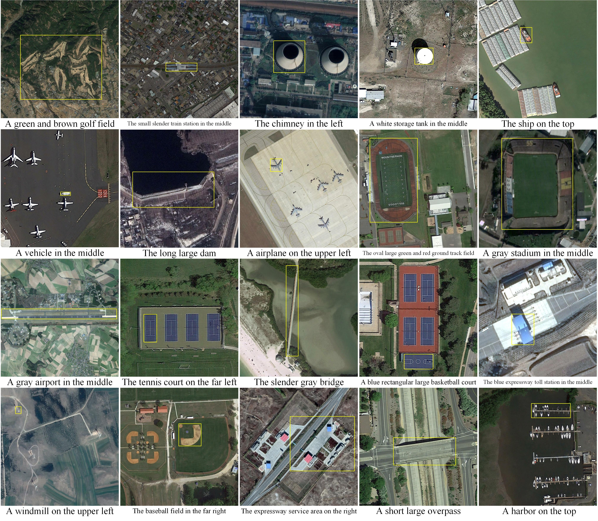

# RSVG: Exploring Data and Model for Visual Grounding on Remote Sensing Data
##### Author: Zhan Yang 
This is the offical PyTorch code for paper **"RSVG: Exploring Data and Model for Visual Grounding on Remote Sensing Data"**, [Paper](https://ieeexplore.ieee.org/document/10056343).

## Please share a <font color='orange'>STAR ⭐</font> if this project does help


## 💬 News
**[2023/04/10]**: Update the DIOR_RSVG dataset and the source code.

**[2022/11/07]**: Release the DIOR_RSVG dataset.  

**[2022/10/22]**: Release the training code. Publish the manuscript on arXiv.


## Introduction
This is Multi-Granularity Visual Language Fusion (MGVLF) Network, the PyTorch source code of the paper "RSVG: Exploring Data and Model for Visual Grounding on Remote Sensing Data". It is built on top of the [TransVG](https://github.com/djiajunustc/TransVG) in PyTorch. Our method is a transformer-based method for visual grounding for remote sensing data (RSVG). It has achieved the SOTA performance in the RSVG task on our constructed RSVG dataset.


### DIOR-RSVG Dataset
<p align="middle">
    
</p>


### Statistics of the Visual Grounding Dataset
|                                                                                                                                   **Dataset**                                                                                                                                   |   **train**    | **val**      | **test**     | **Overall** |
|:-------------------------------------------------------------------------------------------------------------------------------------------------------------------------------------------------------------------------------------------------------------------------------:|:--------------:|:------------:|:------------:|:------------:|
|                                                  Flickr30k [[Paper]](https://arxiv.org/abs/1505.04870) [[Code]](https://github.com/BryanPlummer/pl-clc) [[Website]](http://web.engr.illinois.edu/~bplumme2/Flickr30kEntities/)                                                  |  29783 (94%)   | 1000 (3%)    | 1000 (3%)    | 31783       |
|                                                                                 ReferItGame [[Paper]](http://www.aclweb.org/anthology/D14-1086) [[Website]](http://tamaraberg.com/referitgame/)                                                                                 |  54127 (45%)   | 5842 (5%)    | 60103 (50%)  | 120072      |
|                                                                                      RefCOCO [[Paper]](https://arxiv.org/pdf/1608.00272.pdf)[[Code]](https://github.com/lichengunc/refer)                                                                                       |  120624 (85%)  | 10834 (7%)   | 5657 (3%)    | 142210      |
|                                                                                      RefCOCO+ [[Paper]](https://arxiv.org/pdf/1608.00272.pdf)[[Code]](https://github.com/lichengunc/refer)                                                                                      |  120191 (85%)  | 10758 (7%)   | 5726 (4%)    | 141564      |
|                                                                 GuessWhat [[Paper]](https://arxiv.org/abs/1611.08481) [[Code]](https://github.com/GuessWhatGame/guesswhat/) [[Website]](https://guesswhat.ai/#)                                                                 |      70%       | 15%          | 15%          | 100%        |
|                           Cops-Ref [[Paper]](http://openaccess.thecvf.com/content_CVPR_2020/papers/Chen_Cops-Ref_A_New_Dataset_and_Task_on_Compositional_Referring_Expression_CVPR_2020_paper.pdf) [[Code]](https://github.com/zfchenUnique/Cops-Ref)                           | 119603 (80.5%) | 16524 (11%)  | 12586 (8.5%) | 148713      |
|                                                                                  KB-Ref [[Paper]](https://arxiv.org/pdf/2006.01629) [[Code]](https://github.com/wangpengnorman/KB-Ref_dataset)                                                                                  |  31284 (72%)   | 4000 (10%)   | 8000 (18%)   | 43284       |
| Ref-Reasoning [[Paper]](http://openaccess.thecvf.com/content_CVPR_2020/papers/Yang_Graph-Structured_Referring_Expression_Reasoning_in_the_Wild_CVPR_2020_paper.pdf) [[Code]](https://github.com/sibeiyang/sgmn) [[Website]](https://sibeiyang.github.io/dataset/ref-reasoning/) |  721164 (91%)  | 36183 (4.6%) | 34609 (4.4%) | 791956      |
|                                                                           RSVG [[Paper]](https://dl.acm.org/doi/abs/10.1145/3503161.3548316) [[Website]](https://sunyuxi.github.io/publication/GeoVG)                                                                           |   5505 (70%)   | 1201 (15%)   | 1227 (15%)   | 7933        |
|                                                                                      **DIOR-RSVG** [[Paper]](https://ieeexplore.ieee.org/document/10056343) [[Code]](https://github.com/ZhanYang-nwpu/RSVG-pytorch)                                                                                      |  **26991 (70%)**   | **3829 (10%)**   | **7500 (20%)**   | **38320**       |


### Network Architecture
<p align="middle">
    
</p>


## Requirements and Installation
We recommended the following dependencies.
- Python 3.6.13
- PyTorch 1.9.0
- NumPy 1.19.2
- cuda 11.1
- opencv 4.5.5
- torchvision

## Download Data
Download our constructed RSVG dataset files. We build the first large-scale dataset for RSVG, termed DIOR-RSVG, which can be downloaded from our [Google Drive](https://drive.google.com/drive/folders/1hTqtYsC6B-m4ED2ewx5oKuYZV13EoJp_?usp=sharing). The download link is available below:
```
https://drive.google.com/drive/folders/1hTqtYsC6B-m4ED2ewx5oKuYZV13EoJp_?usp=sharing
```
   
We expect the directory and file structure to be the following:
```
./                      # current (project) directory
├── models/             # Files for implementation of RSVG model
├── utils/              # Some scripts for data processing and helper functions 
├── saved_models/       # Savepath of pth/ckpt and pre-trained model
├── logs/               # Savepath of logs
├── data_loader.py      # Load data
├── main.py             # Main code for training, validation, and test
├── README.md
└── DIOR_RSVG/          # DIOR-RSVG dataset
    ├── Annotations/    # Query expressions and bounding boxes
    │   ├── 00001.xml/
    │   └── ..some xml files..
    ├── JPEGImages/     # Remote sensing images
    │   ├── 00001.jpg/
    │   └── ..some jpg files..
    ├── train.txt       # ID of training set    （26991）
    ├── val.txt         # ID of validation set  （3829）
    └── test.txt        # ID of test set        （7500）
```

## Training and Evaluation
1、Download dataset and pre-trained model（detr-r50-e632da11.pth）

2、Train
```
python main.py
```
Run ```main.py``` using ```--test False``` to train new models on DIOR-RSVG.

3、Evaluate trained models on DIOR-RSVG
Run ```main.py``` using ```--test True```.
Remember to set "--resume" and "--pretrain" to your needs in the parameters.

## Reference
If you found this code useful, please cite the paper. Welcome :+1:_<big>`Fork and Star`</big>_:+1:, then I will let you know when we update.
```
@ARTICLE{10056343,
  author={Zhan, Yang and Xiong, Zhitong and Yuan, Yuan},
  journal={IEEE Transactions on Geoscience and Remote Sensing}, 
  title={RSVG: Exploring Data and Models for Visual Grounding on Remote Sensing Data}, 
  year={2023},
  volume={61},
  number={},
  pages={1-13},
  doi={10.1109/TGRS.2023.3250471}
  }
```

## Acknowledgments
Our DIOR-RSVG is constructed based on the [DIOR](http://www.escience.cn/people/JunweiHan/DIOR.html) remote sensing image dataset. We thank to the authors for releasing the dataset. Part of our code is borrowed from [TransVG](https://github.com/djiajunustc/TransVG). We thank to the authors for releasing codes. I would like to thank Xiong zhitong and Yuan yuan for helping the manuscript. I also thank the School of Artificial Intelligence, OPtics, and ElectroNics (iOPEN), Northwestern Polytechnical University for supporting this work.
