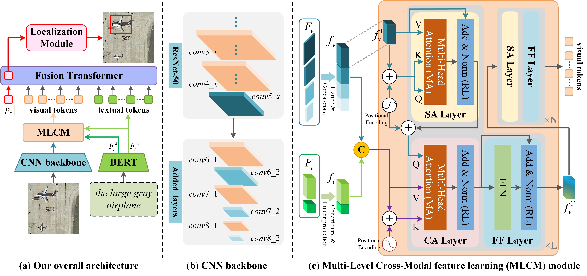

# RSVG: Exploring Data and Model for Visual Grounding on Remote Sensing Data
##### Author: Zhan Yang 
The offical PyTorch code for paper "RSVG: Exploring Data and Model for Visual Grounding on Remote Sensing Data", arXiv.

## Introduction
This is Multi-level Cross-modal Fusion Network, the PyTorch source code of the paper "RSVG: Exploring Data and Model for Visual Grounding on Remote Sensing Data". It is built on top of the [TransVG](https://github.com/djiajunustc/TransVG) in PyTorch. Our method is a transformer-based method for visual grounding for remote sensing data (RSVG). It has achieved the SOTA performance in the RSVG task on our constructed RSVGD dataset.

### Network Architecture
<p align="middle">
    
</p>

## Requirements and Installation
We recommended the following dependencies.
- Python 3.6.13
- PyTorch 1.9.0
- NumPy 1.19.2
- cuda 11.1
- opencv 4.5.5
- torchvision

## Download Data
Download our constructed RSVGD dataset files. We build the first large-scale dataset for RSVG, termed RSVGD, which can be downloaded from our [Google Drive](https://drive.google.com/drive/folders/1hTqtYsC6B-m4ED2ewx5oKuYZV13EoJp_?usp=sharing). The download link is available below:
    ```
    https://drive.google.com/drive/folders/1hTqtYsC6B-m4ED2ewx5oKuYZV13EoJp_?usp=sharing
    ```
.
   
We expect the directory and file structure to be the following:
```
./                      # current (project) directory
├── RSVGD/              # RSVGD dataset
│   ├── Annotations/
│   │   ├── 00001.xml/
│   │   └── ..some xml files..
│   ├── JPEGImages/
│   │   ├── 00001.jpg/
│   │   └── ..some jpg files..
│   ├── train.txt
│   ├── val.txt
│   └── test.txt
├── models/             # Files for implementation of RSVG model
├── utils/              # Some scripts for data processing and helper functions 
├── saved_models/       # Savepath of pth/ckpt and pre-trained model
├── data_loader.py      # Files for construct dataset
├── train.py            # code for training HSNet
├── README.md           # intstruction for reproduction           
└── 00/           # 
```
